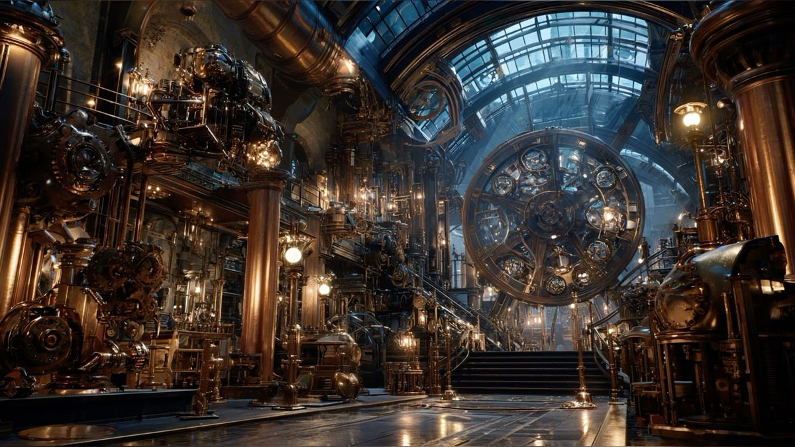

# ⚙️ Steampunk Design - Catálogo de Artefactos

**Plataforma Premium de Exhibición y Catálogo**
Una experiencia inmersiva diseñada bajo la estética retro-futurista *Steampunk*, donde la ingeniería victoriana se encuentra con la tecnología moderna.

---

## 🎩 Autor y Propietario
* **Propietario:** Dennis Ferraro
* **Proyecto:** Steampunk Design - Forjando el pasado del futuro.

---

## 🚀 Funcionamiento del Sistema

El sitio ha evolucionado de una estructura estática a un sistema de **renderizado dinámico basado en componentes**, optimizando la gestión de inventario sin necesidad de bases de datos externas complejas.

### 1. Base de Datos Local Centralizada
Toda la información de los productos (títulos, precios, descripciones de elaboración, fotos de galería y videos de YouTube) se gestiona desde un único archivo maestro: `js/productos_data.js`. Esto permite actualizar todo el catálogo en segundos.

### 2. Plantilla de Detalles Dinámica (`detalles.html`)
Se implementó un motor de plantillas en el lado del cliente que utiliza parámetros de URL (`?id=...`) para generar sub-homes individuales para cada producto. 
* **Video Automation:** El sistema convierte automáticamente cualquier enlace de YouTube (normal o corto) a formato *Embed* para asegurar su visualización.
* **Galería Inteligente:** Las fotos adicionales se inyectan dinámicamente si existen en la base de datos.
* **Responsive Typography:** Uso de `clamp()` y `text-break` para asegurar que los títulos nunca desborden en pantallas móviles.

### 3. Logística de Compra y Carrito
* **LocalStorage Persistence:** El carrito de compras guarda el estado del inventario seleccionado por el usuario, permitiendo navegar entre categorías sin perder los artículos.
* **Módulo de Checkout (WhatsApp API):** Al finalizar la orden, el sistema construye un mensaje estructurado con el listado de artefactos y el total, redirigiendo al usuario directamente al WhatsApp del propietario para concretar la adquisición.

### 4. Efectos Atmosféricos y Mecánicos
* **Ambient Smoke:** Generador de vapor industrial que flota en segundo plano para reforzar la estética.
* **Master Power Lever:** Una palanca interactiva en el footer que permite "apagar" o "encender" la energía de la web (clase `power-off`), acompañada de ráfagas de vapor y efectos eléctricos (chispas).

---

## 🛠️ Tecnologías Utilizadas

* **HTML5 Semántico**: Estructura optimizada para accesibilidad.
* **CSS3 Premium**: Gradientes de metales preciosos (cobre, bronce, latón), fuentes tipográficas *Cinzel* y *Outfit*, y animaciones de engranajes.
* **Bootstrap 5**: Esqueleto de responsividad y componentes de carrusel.
* **JavaScript Vanilla**: Lógica de renderizado, gestión de datos y efectos visuales sin dependencias pesadas.

---

## 🔧 Instalación Local

1. Clonar el repositorio.
2. Abrir `index.html` (se recomienda usar **Live Server** para asegurar el correcto funcionamiento del LocalStorage y las rutas relativas).

---
*Hecho a mano; Forjamos hoy, las antigüedades del mañana.* 🕰️